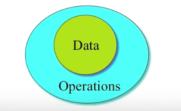
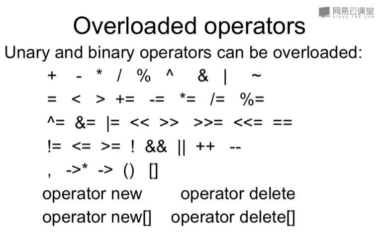
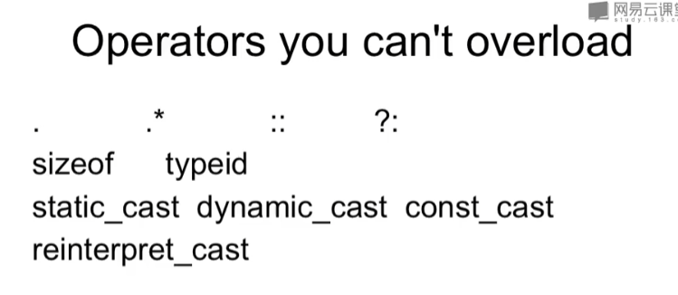
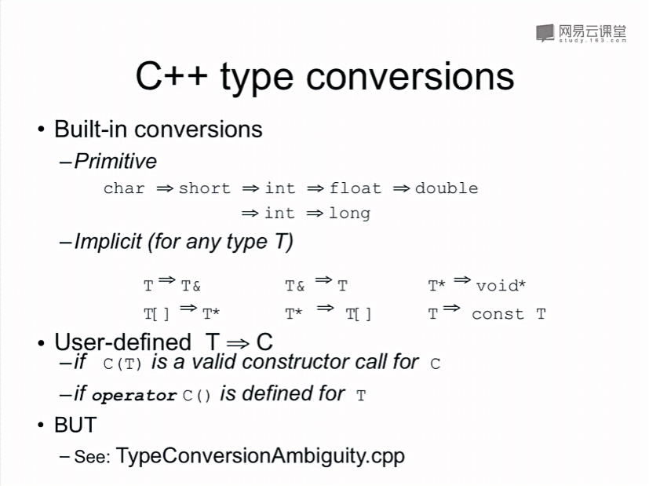

- [课程地址](https://www.bilibili.com/video/BV1yQ4y1A7ts)

- [ ] 第二遍内容：4-1、5-2、7-2、内联函数、指针的指针、静态函数、静态成员
- 第二遍挑选着看，只看自己不懂的

## 1 第一个C++程序
- 文件名不一定有类型。类型和内容是没关系的。
- 所有的事件都是在Project里面发生的
```C++
for ( ; ; );  // infinite loop
```

## 2 什么是面向对象
- 源于对象
- Object = Entity
- class就是structure
- 面向过程：数据和方法分离。面向对象：数据和方法在一个类里。（那STL不是又成面向过程了？）

## 2 面向对象基本概念


- Obects send and receive message
- Messages are
    - Composed by the sender
    - Interpreted by the receiver
    - Implemented by methods
- Messages
    - May cause reveiver to change state
    - May return results

- Data: the properties or status
- Operations: the functions
- 在C++中，类和类型是相同的

- OOP Characteristics:
    - 1.Everything is an object
    - 2.A program is a bunch of objects telling each other what todo by sending meeages.
    - 3.Each objects has its own memory made up of other objects.
    - 4.Every object has a type.
    - 5.All objects of a particular type can reveive the same messages.
- An objects has an interface
    - The interface is the way it reveives messages
    - It is defined in the class the object belong to.

## 3 自动售票机例子
```C++
// ticket_mechine.h
#ifndef TICKET_MECHINE_H
#define TICKET_MECHINE_H

class TicketMechine
{
public:
	TicketMechine();
	virtual ~TicketMechine() {};
	void showPrompt();
	void insertMoney(int money);
	void showBalance();
	void printTicket();
	void showTotal();
private:
	const int PRICE;
	int balance;
	int total;
};

#endif  // TICKET_MECHINE_H
```
```C++
// ticket_mechine.cpp
#include "ticket_mechine.h"

#include <iostream>
using namespace std;

TicketMechine::TicketMechine() : PRICE(0)
{
	balance = 0;
	total = 0;
}

void TicketMechine::showPrompt()
{
	cout << "something";
}

void TicketMechine::insertMoney(int money)
{
	balance += money;
}

void TicketMechine::showBalance()
{
	cout << balance;
}

```
```C++
// source.cpp
#include "ticket_mechine.h"

int main()
{
	TicketMechine tm;
	tm.insertMoney(100);
	tm.showBalance();
	return 0;
}
```

## 4 头文件
- 声明和定义
	- 类和结构体只有声明
	- 变量extern是声明，其他情况是定义
	- 函数略

- 标准头文件结构（Standard header file structure）
	- 防止在同一个cpp里面include多次，导致类声明重复出现，导致“redefine”等错误
	- 如果#include cpp的话就更容易出错了，决不能#include cpp
```C++
#ifndef _XXX_H_
#define _XXX_H_  // 如果已经定义，中间的内容不会被编译

#endif // _XXX_H_
```

## 5 时钟的例子
- 抽象(Abstract)
```C++
class ClockDisplay
{
	NumberDisplay hours;
	NumberDisplay minutes;

		... // Constructor and methods ommitted
}
```
```C++
class NumberDisplay
{
	int limit;
	int value;

	... // Constructor and methods ommitted
}
```

## 6 成员变量
- 局部变量(local variable)
- Fieds, parameters, local variables
- 头文件里面声明的变量只是声明declaration，当在main()函数创建对象时，才是definition。对象里面定义了这个变量

## 7 成员变量的秘密
- parameters 和 local variables是一个东西
- 堆栈就是栈(stack)，堆是(sheap)
- 函数是属于类的，变量是属于对象的。
- 当你用C实现所有的C++特性，那么你的理解就到位了。
- 翻译器把C++翻译成C

## 8 构造与析构
- “烫烫”（0xcd）是没有初始化过的内存

## 9 对象初始化
- 变量内存空间在进入大括号时就分配了，但是构造函数在运行到那一行时才调用。
- 在C++和Struct是一样的，只有细微差别
```C++
int c[] = {1, 2, 3, 4};
int c_size = sizeof(c) / sizeof(*c);

struct X {int i; float f; char c;}
X x1 = { 1, 2.2, 'c' };
X x2[3] = { {1, 1.1, 'a'}, {2, 2.2, 'b'}};

struct Y {float f; int i; Y(int a); };
Y y1[] = { Y(1), Y(2), Y(3) };
Y y2[2] = { Y(1) };  // error 这个结构体没有默认构造函数
```
- 这也是结构体和类的一个区别，编译器不为结构体提供默认构造函数

## 10 new&delete
- new类时会调用构造函数，delete调用析构函数
- new的时候先分配空间再初始化，delete时先析构再收回空间
- 对于一个对象数组，如果delete没有加[]，那么只有第一个对象的析构函数会被调用。空间是都被收回的。
- delete是从后向前的
- ```if(p) delete p;```

## 11 访问限制
- private、public、protected
- 类和结构体另一个区别：类默认是private、struct默认public

### private
- [ ] 相同类型的两个对象，竟然可以互相访问私有成员变量。所以private是对类来说的，不是对对象来说的。private的限制仅仅只在编译时刻。
- C++的OOP只在源代码时存在。编译成二进制就什么也不管了。
- 友元（类、函数）可以访问私有成员
- [x] struct也可以前向声明！

## 12 初始化列表
- 这时候变量初始化早于构造函数执行。初始化 = 分配 + 赋值
- 建议类里面的所有成员变量，都用初始化列表初始化
- [ ] 老师留下一个疑问

## 13 对象组合
- Objects can be used to build up other objects
- 两种内存模型：
	- Fully（肚子里）
	- By reference（肚子外）

## 14 继承
- 基类的几种称呼：
	- Base Class
	- Super Class
	- Parent Class
- 派生类的几种称呼：
	- Derived Class
	- sub Class
	- Child Class

## 15 子类父类关系
- overload、override
- 父类构造函数的调用放在初始化列表的位置
- 子类会屏蔽掉父类的同名方法，父类所有的重载都会被隐藏掉。

## 16 函数重载和默认参数
- 返回类型不能构成```overload```
- 软件工程不建议Defalut Value，容易误读，而且Default Value也容易被修改。

## 17 内联函数
- 调用一个函数所需:
	- Push parameters
	- Push return address
	- Prepare return values
	- Pop all pushed
- 内联函数在编译期就已经替换掉对应调用代码
- 宏不能类型检查，Inline可以类型检查。inline是声明，所以不放到cpp里面
- inline函数过于大，编译期可能会拒绝

## 19 const
- ```extern const int bufsize``` 只是说```bufsize```在当前文件是const，至于它是不是真的const，那是另外一回事（和下面一样，也不能用于分配数组大小，因为编译时编译器不知道bufsize具体的值）

- const value can be exploited

```C++
const int class_size = 12;
int finalGrade[class_size];  // ok

int x;
cin >> x;
const int size = x;
double classAverage[size];  // error，因为编译器在编译时无法知道size的大小，就没法分配内存
```

### Pointers and const
```C++
char* const q = "abc";  // 指针是const，指向的内存可以修改（这一行编译会报错： error C2440: 'initializing': cannot convert from 'const char [4]' to 'char *'）
// ChatGtp: 你尝试将字符串字面值 "abc" 赋值给一个指向字符的常量指针 q。字符串字面值是常量，因此不能直接赋值给一个指向非常量的指针。
// ChatGTP: Method 1
const char* const q = "abc";  // 正确的方式，q 是指向字符常量的常量指针

// ChatGTP：Method 2
const char arr[] = "abc";  // 使用字符数组存储字符串字面值
const char* const q = arr;  // 将指针指向字符数组

// My Method
char a = 'a';
char* const q = &a;  // 用这个可以编译通过
*q = 'c';  // OK
q++;  // ERROR


const char* p = "ABCD";  // 指针指向的内存是const，指针是const
// (*p) is a const char
*p = 'b';  // ERROR! (*p) is the const
p++;  // OK
```

### 区分
- const在*之前，const修饰对象（const修饰 *p）
- const在*之后，const修饰指针（const修饰 p）
```C++
Person p1("Fred", 200);
const Person* p = &p1;  // p可以修改，p1不能修改
Person const* p = &p1;  // 同上
Person* const p = &p1;  // p不能修改，p1可以修改
const Person* const p = &p1;  // 指向常量对象的常量指针
```

## 20 不可修改的对象
- 对象是const。整个对象都不能修改
```C++
const Currency the_raise(43, 38);
```

 - 函数后面加const，其实意味着this是const
```C++
int get_day() const { return day; }
```

- const可以构成overload!（有意思）
```C++
#include<iostream>
using namespace std;

class A
{
	int i;
public:
	A() : i(0) {}
	void f() // void f(A* this);
	{ 
		cout << "f()" << endl;
	}

	void f() const // void f(cosnt A* this);
	{ 
		cout << "f() const" << endl;
	}
};
int main()
{
	A a1;
	a1.f();  // f()

	const A a2;
	a2.f();  // f() const

	return 0;
}
```

- 如果成员变量是const，必须要在初始化列表进行初始化。

## 21 引用（Reference）
- 三种放变量的地方：栈、堆、全局数据区
- 三种访问方式：变量、指针、引用（乘一下就是9种）

### Rules of references
- 引用可以做左值
- 引用定义的时候必须初始化

```C++
const int& z = x;  // 不能通过z修改x（z本身不能被修改，自然不能修改x了）
```

- Reference的出现是为了让指针看起来少一些星号(*)
- Reference的地址是取不到

- The target of a reference must have a location!
```C++
void func(int&);
func (i * 3);  // Warnning or Error!（结果是有地址的，但是没名字）
```
- 引用做参数和普通参数在调用时是一样的，所以编辑器无法区分。不能这样去重载
- 引用之间是不能赋值的，不存在引用的引用，即便赋值也是各自引用的赋值

### Restrictions
- No references to references
- No pointers to references
    - ``` int&* p;  // illegal```
    - Reference to pointer is ok
    - ```void f(int*& p);```
- No arrays of references（老师：既然reference不是一个实体，就没有reference的数组）

## 22 向上造型（Upcasting）
- 拿到指针之后就可以随心所欲为所欲为了（可怕）
- 类里面就是变量。地址偏移可以移动到下一个变量
- Cast：C->类型转换；CPP->造型；

## 23 多态性
- 运行时确定，Dynamic binding：call the function of the object
- 编译时确定，Static binding：call the function as the code
- 多态对象
- Upcast;

## 24 多态的实现
- 带有virtual函数的对象都会有个vptr
- vptr 指向 vtable

- 返回对象本身是不行的
```C++
class Expr
{
public:
    virtual Expr* newExpr();  // OK
    virtual Expr& clone();  // OK
    virtual Expr self();  // Ok
};

class BinaryExpr : public Expr
{
public:
    virtual BinaryExpr* newExpr();  // OK
    virtual BinaryExpr& clone();  // OK
    virtual BinaryExpr self();  // Error!
}
```
- 因为只有指针和引用才构成多态

## 25 引用再研究
- 类成员中的引用可以不在声明时候赋初值，但是必须在构造函数的初始化列表中赋初值。
- 参数是const引用临时变量可以；不是const的引用临时变量就不可以了
- C++最复杂的地方就是内存模型

## 26 拷贝构造Ⅰ（The Copy Constructor）
- C++ 要分清：initialization VS Assignment；declaration VS definition;
- 因为走了拷贝构造函数，所以绕过了构造函数。但是都调用了析构函数，最后导致计数为负。

## 27 拷贝构造Ⅱ
- 指针类型要单独处理，进行深拷贝。否则多个个实例成员指针指向一个地址可能会出错，比如同一个空间析构多次。
- 就是字符串的new，之前书里面有
- size_t 随系统变化
- 圆括号初始化和等号初始化是等价的，让自己接受这种写法。

```C++
// Example
Person copy_func(char* who)
{
    Person local(who);
    local.print();
    return loca;  // copy ctor called!
}

Person nocopy_func(char* who)
{
    return Person(who);  // no copy needed, 编译器会优化掉拷贝构造，因为编译器认为不需要。
}
```
- 尽量用string，这样编译器在成员拷贝时就会调用string的拷贝构造，就不会出错了。
- 当你写一个类时：构造，虚析构，拷贝构造尽量都写一个。
- 或者你把拷贝构造设置为私有的，这样别人就用不了了。很多地方用不了，相当于自己给自己上铐。

## 28 静态对象（重点）（视频待看...）
### 28.1 Static in C++
- 第一种含义：Static storage：Allocated once at a fixed address
- 第二种含义：Visiblity of a name：internal linkage
- Don't use static except inside functions and classes.
- Static的局部变量就是全局变量，它是放在一个地方的

### 28.2 Uses of "Static" in C++
| Type | Usage |
|--|--|
|Static free functions | ~~Internal linkage~~ (deprecated) |
|Static global variables | ~~Internal linkage~~ (deprecated) | 
|Static local variables | Persistent storage |
|Static member variables | Shared by all instances |
|Static member function | Shared by all instances, can only access static member variables |

### 28.3 Global static hideen in file

### 28.4 Static inside function
- Value is rememberd for entire program
- Initialization occurs only once

### 28.5 Static applied to objects
- Suppose you have a class
- And a function with a static X Object
- Construction occurs when definition is encountered
    - Constructor called at-most once
    - The constructor arguments must be satisfied
- Destruction takes place on exit from program 
    - Compiler assures LIFO order of destructors

### 28.6 Conditional construction

### 28.7 Global objects 

### 28.8 Staic Initialization Dependency
- Order of Construction within a file is konwn
- Order between file is unspecified!
- Problem when non-local static objects in different file have dependencies.
- A non-local static object is:
    - defined at global or namespace scope
    - declared static in a class
    - defined static at file scope

## 29 静态成员
### Can we apply static to members?
- Static means
    - Hidden
    - Persistent
- Hidden: A Static member is a member
    - Obeys usual access rules
- Persistent: Independent of instances（函数之间仍然存在的东西，如全局变量，new出来的，static的）
- Static member are class-wide
    - variables or
    - functions

- this指针也可以访问到静态变量，不是非要用类名::的方式。这将事情是静态变量和普通成员变量是没有差异的。
- static包含了作用域（范围）控制，const包含了读写控制。
- 实现机制很简单：就是一个全局变量，这个全局变量也是类的成员。
- 静态的成员函数只能访问静态的成员变量。原因是静态成员函数里面没有this，这是希望没有对象的时候可以调用静态成员函数去做一些事情。（UE里面的很多管理器就是这样）

## 30 运算符重载(Overloading Operator)——基本规则



### Restrictions
- Only existing operators can be overloaed(you can't create a** operator for exponentiation)
- Operators must be overloaded on a class or enumeration type
- Overloaded operator must be overloaded on a class or enumeration type
    - Preserve number of operands
    - preserve precedence

- 可以从作为成员函数和非成员函数两个角度看和使用

- 运算符左边的那个算子叫做receiver，编译器根据receiver来决定使用那个算子的运算符重载函数来处理这次运算。

- 返回值优化：当返回的对象在函数体内没有被使用时，编译器可以进行优化，避免不必要的拷贝构造。这种优化称为返回值优化（Return Value Optimization，RVO）或者命名返回值优化（Named Return Value Optimization，NRVO）。
```C++
#include <iostream>

class MyType {
public:
    MyType() { std::cout << "Default Constructor" << std::endl; }
    MyType(const MyType& other) { std::cout << "Copy Constructor" << std::endl; }
};

MyType createObject() {
    return MyType(); // 返回一个临时对象（进行了返回值优化）
}

int main() {
    MyType obj = createObject(); // 调用 createObject 函数并初始化 obj

    return 0;
}
```

- int到double是自动类型转换，double到int是强制类型转换。不能直接调用我们的运算符重载（大概是这个意思）。
- Global Operators中，z = 3 + y, z = 3 + 7都是可以的

### Tips：Members vs. Free Functions
- Unary operators should be members
- = () -> ->* must be members
- assignment operators should be members
- All other binary operators as Non-members


## 31 运算符重载——原型
### 31.1 Argument Passing
- if it is read-only pass it in as a const reference(except build-ins)
- make mamber function const that don't change the class(boolean operators, +, -, etc)
- for global functions, if the left-hand side changes pass as a reference(assignment operators)

### 31.2 Return Values
- Select the return type depending on the expected meaning of the operator.For example.
    - For operator+ you need to generated a new object. return as a const object so the result cannot be modified as an lvalue
    - Logical operators should reutrn bool(or int for older compilers).


### 31.3 Operators ++ and --
- 太妙了！
- 通过有参和无参区分前置和后置
- 前置的++返回自身，后置的++返回新对象
```C++
const Integer& Integer::operator++()
{
    *this += 1;  // increment
    return *this;  // fetch
}

// int argument not used so leave unnamed so won't get complier warnings
const Integer Integer::operator++(int)
{
    Integer old(*this);  // fetch
    ++(*this);  // increment
    return old;  // return
}

int main()
{
    Interger x(0);

    ++x;  // calls x.operator++();
    
    x++; // calls x.operator++(0);
}
```


## 32 运算符重载——赋值
### 32.1 Automatic operator= creation
- The compiler will automatically create a type::operator=(type) if you don't make one
- memberwise assignment（成员逐一分配）


## 33 运算符重载——类型转换
### 33.1 Value classes
- Appear to be primitive data types
- Passed to and returned from functions
- Have overloaded operators(often)
- Can be conberted to and from other types
- Examples: Complex, Date, String


### 33.2 User-defined Type conversions
- A conversion operator can be used to convert an object of one class into
    - an object of another class
    - a build-in type

- Compilers perform implicit conversions using:
    - Single-argument constructors
    - implicit type conbersion operators

```C++
class One
{
public:
	One() {}
};

class Two
{
public:
Two(const One&) {}
// explicit Two(const One&) {}
};

void f(Two) {}

int main()
{
	One one;
	f(one);  // Wants a Two, has a One
	f(Two(one));
}
```

- 加了`explicit`就不能通过赋值进行构造了，构造只能用来构造。上面的`f(one)`就行不通了，需要换成`f(Two(one))`。

### 33.3 Conversion operations
- Operator conversion
	- Function will be called automatically
	- Return type is same as funciton name



- 上面的转换，只是看待那块东西的眼光变了，那块东西本身没有发生任何变化。
```C++
class Orange;  // class declaration

class Apple
{
public:
	operator Orange() const;  // Convert Apple to Orange
};

class Orange
{
public:
	// 如果不加explicit，编辑器会报错，不知道应该用那个。加了explicit之后，不让这个构造进行类型转换，编译器就不会纠结了。
	explicit Orange(Apple);  // Convert Apple to Orange
};

void f(Orange) {}

int main()
{
	Apple a;
	// f(a);  // Error: ambiguous conversion
}
```

### 33.4 Do you want to use them?
- In General, no!
	- Cause lots of problems when funcitons are called unexpectedly.
	- See: Copying Vs Initialization2.cpp
- Use explicit conversion functions. For example, in class Rational instead of the conversion operator, declare a memver function:
	- double toDouble() const;

## 34 模板Ⅰ
- 模板的核心思想确实是为了让同一个函数或类能够处理不同的类型，但具体来说，模板提供了一种在编写代码时指定类型参数的机制，这样我们就可以编写与类型无关的代码。

### 定义比较：
- 类模板 (Class Template)：指可以接受类型参数的类定义。（declaration）
- 模板类 (Template Class)：指一个已经实例化了的类模板。（definition）
- 函数模板 (Function Template)：是一种可以接受类型参数的函数定义。（declaration）
- 模板函数 (Template Function)：数通常是指一个已经实例化的函数模板。（definition）

### Interactions
- Only exact match on types is used
- No conversion operations are applied
- Even implicit conversions are ignored
- Template functions and regular functions coexist


## 35 模板Ⅱ
```C++
vector< string > vs;  // 可以读作 vector of string, 比较English的读法
```
### Templates
- Templates can use multiple types
```C++
template < typename Key, typename Value>
class HashTable
{
	...
};
```
- Templates nest - they're just new types!
```C++
vector <vector <double*> >  // note space > >
```
- Type arguments can be complicated
```C++
vector< int (*) (vector<double>&, int) >
```
- can have a default argument

### Templates and inheritance（模板遇上继承）
- 两个文件实例化同一个类型的类模板，编译器如何处理？
  - 方式1：变名字，加个前缀进行区分。 
  - 方式2：合并。让linker合并成一个，但是很麻烦因为所有语言用的是相通linker。

- [ ] 不同文件中的同一个函数模板实例化的指针是否一样？
  - **同一文件内**：Kimi：同一个文件内，对于函数模板的相同实例化，编译器通常只会生成一份代码。这意味着，即使在同一个文件中多次实例化相同的模板，它们在内存中的地址也是相同的。
  - **不同文件内**：Kimi：编译器会为每个文件生成独立的实例。因此，这两个实例在内存中的地址通常是不同的。


## 36 异常基本概念(Exceptions)
- 由**外部**原因引起的异常情况。（内部的就是BUG了）
```C++
try {

} catch(exception case1){
	// do something
} catch(exception case2){
	// do something
};
```

## 37 异常的抛出和捕捉
- 感觉现在没啥人直接用异常了。像UE都是用一个`check()`宏做的检查。猜测：可能是异常情况太多，或者是封装了。用check()检查抛出就行了。但是check()内部如何实现对还不太清楚。
- assert()断言

### How to raise an exception
- 一般会扔一个对象出去。因为对象能携带更多的信息。（感觉有点像Java了）
```C++
class VectorIndexError
{
	// ...
}

...

if (index < 0 || index >= m_size)
{
	throw VectorIndexError(index);
}
```
- `...`: 捕获所有的异常
```C++
void outer3()
{
	try 
	{
		outer2();
	} catch (...)  // C++语法，捕获所有异常
	{
		cout << "Ther exception stop here!";
	}
}
```

## 38 异常语句
- 异常匹配过程是按照你书写的顺序进行匹配的，每个异常又按照下面这3条原则处理：
  - 1.Check for exact match
  - 2.Apply base conbersion(Reference and pointer types,only)
  - 3.Ellipses(...) match all
 
 ### Exception specifications
- 作用是限制`abc()`自己，而不是调用`abc()`的人
```C++
// 如果函数抛出异常，只会抛出这个范围内的异常
void abc(int a) : throw(MathErr)
{
	...
}
```
- At run time, if an exception not in the list propagates out, the`unexpected`exception is raised

```C++
 Printer::print(Document& ) :
	throw (PrinterOffLine, BadDocument)
{ 
	... 
}

PrintManager::print(Document&) :
	throw (BadDocument)
{
	// raises or doesn't handle BadDocument
}

void goodguy() : throw()
{
	// handles all exceptions
}

void average() // no spec, no checking
{ 

}
```

## 39 流的概念
### C I/O vs. C++ streams
- Advantages of streams(流的优势)
  - Better type safety
  - Extensible
  - More object-oriented
- Disadvantages(劣势)
  - More verbose
  - Often slower

### What is a stream?
- 流的特点：一维、单方向
- Common logical interface to a device
- 读取文件的方式也不一样

### Kind of stream
- 二进制文件：不以人的阅读为目的的文件


## 40 流的运算符
### Predefined streams
- cin : standard input
- cout : standard output
- cerr: unbuffered error (debugging) output
- clog: buffered error (debugging) output

### Defined stream
- 流前面不加`const`是因为，函数内需要改变`istream& is` 、`ostream& os`的位置

### More input operators
- `cin.gcount()`
- `cin.putback()`
- `cin.peek()`

### Formatting using manipulators
- `flush` 和 `hex` 并不是关键字，它们是C++标准库中的流操作符(manipulators, 操纵器或者操纵子)。
  - `flush` : 使用 flush 可以立即将缓冲区的内容输出，而不等待缓冲区满。在某些情况下，你可能需要确保输出立即显示，这时可以使用 flush。
  - `hex` : hex 是一个流操作符，用于设置输入或输出流的数字格式为十六进制。

```C++
int main(int argc, char* argv[])
{
	int n;

	cout << "Enter number in hexadecimal: " << flush;
	cin >> hex >> n;

	return 0;
}
```

### Manipulators
- 在计算机英语中`set`通常指定设置为1，`reset`通常指定设置为0

Kimi：
- flush 和 hex 这样的操作符在C++中通常被称为流操纵算子（manipulators）。流操纵算子是用于修改流状态的函数，它们可以改变输入/输出流的行为，比如设置数值的进制格式、调整字段宽度、设置填充字符等。以下是一些常见的流操纵算子：
```C++
std::dec, std::hex, std::oct：// 用于设置数值的输出格式为十进制、十六进制或八进制。
std::left, std::right：// 用于设置文本输出的对齐方式。
std::setw：// 用于设置下一个输出字段的最小宽度。
std::setprecision：// 用于设置浮点数输出的精度。
std::fixed, std::scientific： // 用于控制浮点数的输出格式，固定小数点表示或科学计数法表示。
std::noshowpos, std::showpos：// 用于控制是否显示正号。
std::flush：// 用于强制输出流刷新其缓冲区。
```
- 流操纵算子（manipulators）是专门为输入输出流设计的，它们用于控制流的行为，如格式化输出。在不涉及流的上下文中，流操纵算子没有意义，因为它们依赖于流的状态和特性。

### Creating manipulators (nice!)
- You can define your own manipulators!
```C++
// skeleton for an output stream manipulator
ostream& manip (ostream& out)
{
	...
	return out;
}

ostream& tab (ostream& out)
{
	return out << '\t';
}

int main()
{
	cout << "Hello" << tab << "World!" << endl;
}
```
- 这些manipulator其实都是一个函数，endl也是。只不过这些函数长成上面格式的样子，所以就成了manipulator

### Stream flags control formatting
- 早期计算机喜欢用bit表达这些`ios`标志。每个bit位的含义也不相同。每一个bit是一个标志。把值or起来，最后结果就是1。（看弹幕说和硬件，单片机这些有关系）

- `ios` 类标志位是持久的流状态设置，而 `std::` 流操纵算子是临时的流状态修改。
- 以下是一些 ios 开头的标志位：
```C++
ios::skipws：控制是否跳过空白字符。
ios::dec：设置数值以十进制格式输入输出。
ios::hex：设置数值以十六进制格式输入输出。
ios::oct：设置数值以八进制格式输入输出。
ios::showbase：在输出整数时显示进制前缀（如 0x 表示十六进制，0 表示八进制）。
ios::showpos：在输出正数时显示正号。
ios::uppercase：在输出十六进制数时使用大写字母。
ios::showpoint：在输出浮点数时，即使小数部分为零也显示小数点。
ios::fixed：在输出浮点数时使用固定小数点表示法。
ios::scientific：在输出浮点数时使用科学计数法。
ios::right：设置输出右对齐。
ios::left：设置输出左对齐。
ios::internal：设置输出在字段内部对齐。
```

## 41 STL简述
### What is STL
- STL = Standard Template Library
- Part of the ISO Standard C++ Library
- Data Structures and alogorithms for C++

### The three parts of STL
- Containers
- Algorithms
- Iterators

---
## 写在最后  
终于看完了，前后耗时估计半年，断断续续地看。我还是看了《C++ prime plus》之后来看的，有些内容还是很难理解，比如static那一部分，const这些。不过大体上已经消化吸收了。C++基础部分也学得差不多了，后续可能要学一下更高级的内容，STL的高级内容，面向对象的高级编程，还有最近在学的多线程。 ——2024/09/08


