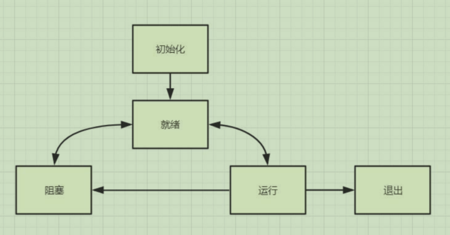

# 第3章 多线程通信和同步

## 3.1 多线程状态
### 3.1.1 线程状态说明
- 初始化(Init): 该线程正在被创建。
- 就绪(Ready): 该线程在就绪列表中，等待 CPU 调度。
- 运行(Running): 该线程正在运行。
- 阻塞(Blocked): 该线程被阻塞挂起。Blocked 状态包括:
    - pend(锁、 事件、信号量等阻塞)
    - suspend(主动 pend)
    - delay(延时阻塞)
    - pendtime(因为锁、事件、信号量时间等超时等待)。

- 退出(Exit):该线程运行结束，等待父线程回收其控制块资源。



### 3.1.2 竞争状态和临界区
- 竞争状态(Race Condition)：多线程同时读写共享数据
- 临界区(Critical Section)：读写共享数据的代码片段
- 避免竞争状态策略，对临界区进行保护，同时只能有一个线程进入临界区


## 3.2 互斥体和锁mutex
### 3.2.1 互斥锁mutex

```C++
#include <thread>
#include <iostream>
#include <string>
#include <mutex>

using namespace std;

static mutex mux; // C++11

void TestThread()
{
	while (true)
	{
		//获取锁资源，如果没有则阻塞等待
		//mux.lock(); // 操作系统层面的锁

		if (!mux.try_lock()) // 尝试去锁，如果失败也做一些事情
		{
			cout << "." << flush;

             // try_lock后一定要加上sleep进行释放，不然不断地尝试就会把资源耗尽
			this_thread::sleep_for(100ms);
            
			continue;
		}

		cout << "==============================" << endl;
		cout << "test 001" << endl;
		cout << "test 002" << endl;
		cout << "test 003" << endl;
		cout << "==============================" << endl;

		mux.unlock();
		this_thread::sleep_for(1000ms);
	}
}

int main(int argc, char* argv[])
{
	for (int i = 0; i < 10; i++)
	{
		thread th(TestThread);
		th.detach();
	}

	getchar();
	return 0;
}
```

### 3.2.2 互斥锁的坑_线程抢占不到资源
- 线程一直持有资源，出不来了。其他线程一直等待，获取不到资源
```C++
#include <thread>
#include <iostream>
#include <string>
#include <mutex>

using namespace std;

static mutex mux; 

void ThreadMainMux(int i) 
{
	for (;;) 
	{
		mux.lock();  // unlock后又立刻进入了lock，操作系统来不及释放。
		cout << i << "[in]" << endl; 
		this_thread::sleep_for(1000ms); 
		mux.unlock();
	}
}

int main(int argc,char *argv[]) 
{
	for (int i = 0; i < 3; i++) 
	{
		thread th(ThreadMainMux, i+1);
		th.detach();
	}
	return 0;
}
```
- 给操作系统1ms释放资源
```C++
void ThreadMainMux(int i) 
{
	for (;;) 
	{
		mux.lock();  // unlock后又立刻进入了lock，操作系统来不及释放。
		cout << i << "[in]" << endl; 
		this_thread::sleep_for(1000ms); 
		mux.unlock();
		this_thread::sleep_for(1ms);  // 给操作系统一些时间来释放资源
	}
}
```
### 3.2.3 超时锁应用 timed_mutex（避免长时间死锁）
- 可以记录锁获取情况，多次超时，可以记录日志，获取错误情况
```C++
timed_mutex tmux; 

void ThreadMainTime(int i) 
{
	for (;;) 
	{
		if (!tmux.try_lock_for(chrono::milliseconds(1000))) 
		{
			cout << i << "[try_lock_for] timeout" << endl; continue;
		}

		cout << i << "[in]" << endl;
		this_thread::sleep_for(2000ms); 
		tmux.unlock(); 
		this_thread::sleep_for(1ms);
	} 
}

int main(int argc,char *argv[]) 
{
	for (int i = 0; i < 3; i++) 
	{
		thread th(ThreadMainTime, i); th.detach();
	}

	return 0;
}
```

### 3.2.4 递归锁(可重入)recursive_mutex 和recursive_timed_mutex 用于业务组合

```C++

```

### 3.2.5 共享锁 shared_mutex

```C++

```

## 3.3 利用栈特性自动释放锁 RAI

### 3.3.1 什么是RAII，手动代码实现

- 手动实现RAII管理mutex资源
```C++

```

### 3.3.2 c++11支持的RAII管理互斥资源 lock_guard

```C++

```

### 3.3.3 unique_lock c++11

```C++

```
### 3.3.4 shared_lock C++14

```C++

```
### 3.3.5 scoped_lock C++17

```C++

```

## 3.4 条件变量

### 3.4.1 condition_variabl

```C++

```

## 3.5 线程异步和通信

### 3.5.1 promise 和 future

```C++

```

### 3.5.2 packaged_task 异步调用函数打包

```C++

```

### 3.5.3 async 创建异步线程

```C++

```